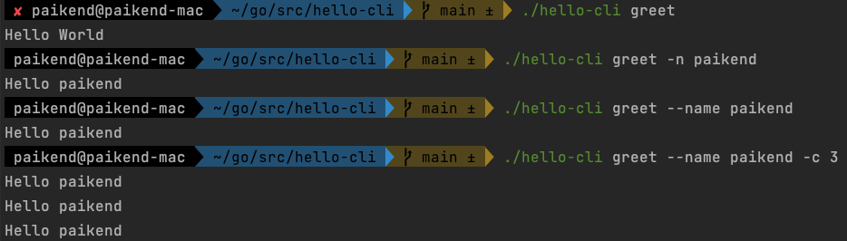

### 1. Install
1. go mod init hello-cli
2. go get -u github.com/spf13/cobra
### 2. Init Project
1. cobra-cli init
2. cobra-cli add greetgl
### 3. Write a application code(update cmd/greet.go)
1. Print Hello World
2. Print Hello ${name}, default name is World
3. (Print Hello ${name}, default name is World) * ${count}, default count is 1
### 4. Results
   
### 5. Write the makefile
